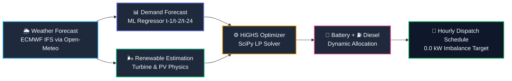
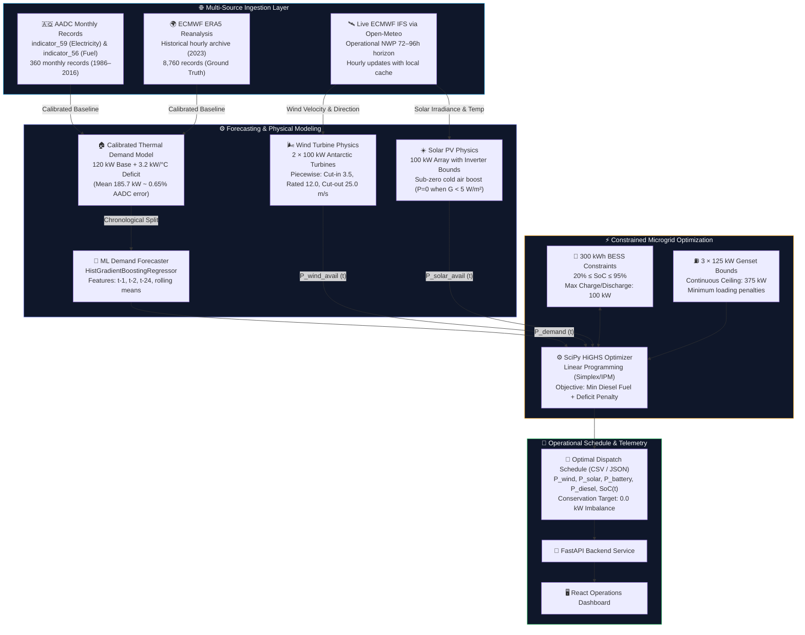
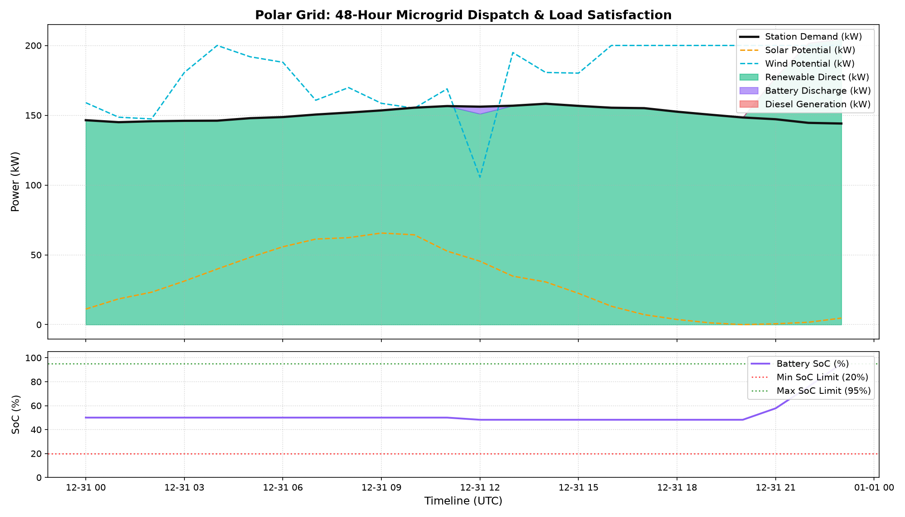
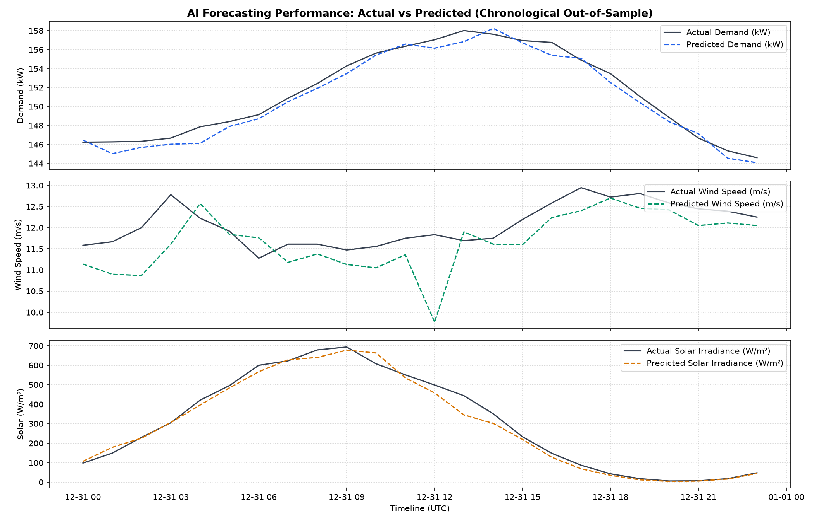
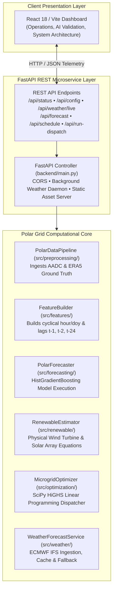

<div align="center">

# ❄️ POLAR GRID

### AI-Assisted Renewable Energy Forecasting & Microgrid Dispatch Optimization

**Case Study: Mawson Station, Mac. Robertson Land, Antarctica**  
📍 `67.6027° S, 62.8738° E` &nbsp;|&nbsp; 🇦🇺 Australian Antarctic Division Baseline

<br/>

[](https://www.python.org/)
[](https://fastapi.tiangolo.com/)
[](https://react.dev/)
[](https://scikit-learn.org/)
[](https://scipy.org/)
[](https://www.ecmwf.int/)
[](#-quick-start)

<br/>

> **Forecast → Estimate → Optimize → Schedule**  
> *An operational decision-support prototype converting numerical weather forecasts and station demand telemetry into physics-based renewable generation estimates and fuel-minimizing microgrid dispatch schedules.*

</div>

---

## 📑 Table of Contents

- [🌨️ The Problem](#️-the-problem)
- [🔎 Existing Gap](#-existing-gap)
- [💡 The Solution](#-the-solution)
- [🚀 Innovation](#-innovation)
- [🧠 Technical Architecture](#-technical-architecture)
- [🌐 Data Sources](#-data-sources)
- [🔬 Scientific Transparency](#-scientific-transparency)
- [🤖 Demand Forecasting](#-demand-forecasting)
- [🧪 Validation](#-validation)
- [📊 Forecast Accuracy](#-forecast-accuracy)
- [🌬️ Renewable Estimation](#️-renewable-estimation)
- [🔋 Battery Storage](#-battery-storage)
- [⛽ Diesel Backup](#-diesel-backup)
- [⚙️ Energy Optimization](#️-energy-optimization)
- [🔄 End-to-End Workflow](#-end-to-end-workflow)
- [🖥️ Prototype Dashboard](#️-prototype-dashboard)
- [📈 Impact & Results](#-impact--results)
- [🧩 Technology Stack](#-technology-stack)
- [🏗️ Software Architecture](#️-software-architecture)
- [🌍 Scalability](#-scalability)
- [✅ Prototype Status](#-prototype-status)
- [▶️ Quick Start](#️-quick-start)
- [🎯 2-Minute SIH Demo](#-2-minute-sih-demo)
- [📚 Documentation](#-documentation)
- [❄️ Project Philosophy](#️-project-philosophy)

---

## 🌨️ The Problem

Antarctic scientific stations operate as isolated microgrids in the harshest terrestrial environment on Earth. Managing station power presents unique operational vulnerabilities:

| Challenge Card | Core Vulnerability | Operational Reality |
| :--- | :--- | :--- |
| **🌨️ Weather Uncertainty** | Extreme sub-zero temperatures (down to -36.4°C) and blizzards | Solar irradiation drops to zero during polar night; wind swings violently from calm to severe katabatic gales exceeding 100 km/h. |
| **📈 Demand Variability** | Thermal heating surge vs. base electrical load | Station electric heating demand surges by **+37.3%** during deep winter (July mean: 212.9 kW) compared to summer (January mean: 155.1 kW). |
| **🔋 Limited Storage** | Costly electrochemical battery capacity | Extreme logistics limit battery energy storage system (BESS) sizing to buffering scales (300 kWh), requiring strict SoC preservation. |
| **⛽ Diesel Dependence** | High-emission, supply-chain vulnerable generation | Stations rely heavily on diesel fuel transported via specialized icebreakers during brief summer windows at immense financial and ecological cost. |
| **🔄 Manual Coordination** | Reactive operational decisions | Station operators currently dispatch diesel generators reactively without multi-hour lookahead coordination between weather, storage, and demand. |

---

## 🔎 Existing Gap

Isolated polar microgrids require synchronized orchestration across five operational variables that are conventionally evaluated in silos:

```
CURRENT / MANUAL APPROACH (UNCOORDINATED)
┌──────────────────┐  ┌──────────────────┐  ┌──────────────────┐  ┌──────────────────┐  ┌──────────────────┐
│ Weather Forecast │  │ Station Demand   │  │ Renewable Power  │  │ Battery State    │  │ Diesel Reserve   │
│ (Raw Met-Ocean)  │  │ (Reactive Loads) │  │ (Variable Wind)  │  │ (Manual Reading) │  │ (Continuous Run) │
└────────┬─────────┘  └────────┬─────────┘  └────────┬─────────┘  └────────┬─────────┘  └────────┬─────────┘
         │                     │                     │                     │                     │
         └─────────────────────┴───────────┬─────────┴─────────────────────┴─────────────────────┘
                                           │
                                           ▼
                 [ REACTIVE / UNCOORDINATED OPERATOR DECISIONS ]
                 - Diesel generators run continuously at low load efficiency
                 - Available wind and solar power frequently curtailed
                 - Battery cycled inefficiently without lookahead headroom
```

```
POLAR GRID (INTEGRATED DECISION SUPPORT)
┌────────────────────────────────────────────────────────────────────────────────────────┐
│                                   POLAR GRID ENGINE                                    │
│                                                                                        │
│   ECMWF Weather Ingestion ──────► Physics-Based Renewable Model (Wind + Solar)         │
│                                                   │                                    │
│   AADC Historical Telemetry ────► ML Demand Predictor (HistGradientBoosting)           │
│                                                   │                                    │
│                                                   ▼                                    │
│                                 [ HiGHS LINEAR PROGRAMMING ]                           │
│                                 (Coordinates BESS + Diesel)                            │
│                                                   │                                    │
│                                                   ▼                                    │
│                                📅 OPTIMAL HOURLY DISPATCH SCHEDULE                     │
│                                • Guaranteed Power Balance (0.0 kW Imbalance)           │
│                                • Maximized Renewable Penetration                       │
│                                • Minimized Diesel Fuel Consumption                     │
└────────────────────────────────────────────────────────────────────────────────────────┘
```

---

## 💡 The Solution

Polar Grid provides a forward-looking decision-support pipeline that coordinates generation, storage, and consumption across a 24–72 hour operational horizon:



1. **🌦️ Weather Forecast**: Ingests official hourly ECMWF IFS numerical weather prediction (NWP) parameters (wind speed, solar irradiance, ambient temperature).
2. **📊 Demand Forecast**: Evaluates thermal heating degree deficits and historical Mawson occupancy rhythms to predict station electrical load.
3. **🌬️ Renewable Estimation**: Converts meteorological forecasts into realistic electric power using manufacturer cut-in/rated/cut-out wind curves and thermal PV derating.
4. **⚙️ Optimization**: Solves an hourly Linear Programming (LP) problem with the SciPy HiGHS solver to minimize fuel cost while respecting physical device limits.
5. **🔋 Battery + ⛽ Diesel Coordination**: Determines exact charge/discharge rates, respecting 20%–95% SoC bounds and preventing generator under-loading.
6. **📅 Hourly Dispatch Schedule**: Exports an hour-by-hour operational schedule guaranteeing exact power conservation ($0.0\text{ kW}$ imbalance).

---

## 🚀 Innovation

Polar Grid differentiates itself technically by combining authoritative meteorological models, machine learning, and linear programming without inflated claims:

- **🌦️ Live ECMWF NWP Ingestion**: Ingests operational numerical weather forecasts directly from the European Centre for Medium-Range Weather Forecasts (ECMWF IFS 0.25° grid) with automated local caching and historical fallback.
- **🤖 Dedicated ML Station Demand Model**: Employs an ensemble `HistGradientBoostingRegressor` trained strictly on backward-looking features ($t-1, t-2, t-24$) to forecast station electrical load.
- **🌬️ Physics-Based Equipment Modeling**: Uses deterministic physical aerodynamics and photovoltaic equations rather than black-box models for power generation.
- **⚙️ Provable HiGHS Microgrid Optimization**: Employs industry-standard Simplex/Interior-Point optimization guaranteeing exact mathematical optimality and zero power deficit.
- **🔋 Battery-Aware Reserve Management**: Treats battery storage as a dynamic buffer, enforcing cyclic efficiency ($90\%$) and reserve floors ($20\%$ SoC) to avoid cold-temperature degradation.
- **⛽ Diesel Minimization Under Strict Reliability**: Guarantees zero unmet scientific load while turning off or ramping down generators whenever wind and solar suffice.
- **🔎 Transparent Data Boundary**: Maintains an uncompromising boundary between authentic observations, numerical forecasts, and derived model outputs.

> [!IMPORTANT]
> **Scientific Integrity Notice**: Polar Grid does **NOT** use AI to predict atmospheric weather patterns. Atmospheric weather forecasting is performed by the world-class **ECMWF IFS** supercomputing numerical model. Polar Grid uses ECMWF forecasts to estimate renewable generation and optimize microgrid dispatch.

---

## 🧠 Technical Architecture

The architecture decouples historical telemetry calibration from real-time operational optimization:



---

## 🌐 Data Sources

Polar Grid integrates four distinct datasets, each rigorously classified by provenance and role:

| Component | Source Reference | Frequency | Record Count & Period | Category | Operational Purpose |
| :--- | :--- | :---: | :---: | :---: | :--- |
| **Station Electricity Telemetry** | Australian Antarctic Data Centre (`indicator_59.csv`) | Monthly | 360 records<br/>(1986–2016) | 🟢 **REAL DATA** | Authoritative ground-truth baseline for Mawson electrical demand (~185 kW average). |
| **Generator Fuel Telemetry** | Australian Antarctic Data Centre (`indicator_56.csv`) | Monthly | 278 records<br/>(1993–2016) | 🟢 **REAL DATA** | Station diesel generator fuel consumption history used to calibrate engine brake curves. |
| **Atmospheric Climate Archive** | ECMWF ERA5 Reanalysis | Hourly | 8,760 records<br/>(Full Year 2023) | 🟢 **REAL DATA** | Full-year surface irradiance, wind speed, air temperature, and air pressure for model training. |
| **Operational Weather Forecast** | ECMWF IFS via Open-Meteo API | Hourly | 72–96 hours forward<br/>(Continuous) | 🟠 **LIVE FORECAST** | Operational NWP inputs driving live renewable estimations and lookahead microgrid dispatch. |
| **Hourly Demand Profile** | Thermal degree-day + occupancy model | Hourly | 8,760 records<br/>(Calibrated) | 🔵 **MODELED DATA** | Hourly load synthesizing 120 kW base scientific load with 3.2 kW/°C thermal heating demand. |

---

## 🔬 Scientific Transparency

In strict alignment with SIH judging credibility, all project data is classified into **Real** vs. **Modeled** categories without ambiguity:

```
┌───────────────────────────────────────────────┬───────────────────────────────────────────────┐
│                🟢 REAL DATA                   │               🔵 MODELED DATA                 │
│         (Authentic Historical / NWP)          │       (Derived Equations & Algorithms)        │
├───────────────────────────────────────────────┼───────────────────────────────────────────────┤
│ • AADC Indicator 59: Monthly station energy   │ • Hourly Station Demand (calibrated to AADC)  │
│ • AADC Indicator 56: Monthly generator diesel │ • Wind Turbine Generation (piecewise curve)   │
│ • ECMWF ERA5 Reanalysis: Full year 2023       │ • Solar PV Generation (thermal derating)      │
│ • ECMWF IFS: Operational numerical forecasts  │ • Battery Charge/Discharge Dispatch & SoC     │
│ • Station Geographic Coordinates & Altitude   │ • Generator Dispatch & Fuel Savings Profile   │
│ • Generator & Turbine Manufacturer Specs      │ • HiGHS Mathematical Dispatch Schedule       │
└───────────────────────────────────────────────┴───────────────────────────────────────────────┘
```

- **Monthly vs Hourly Calibration**: Because real-time SCADA sub-second meter telemetry is not published publicly by polar research divisions, hourly load is synthesized using thermodynamic building loss equations ($P_{\text{heat}} = 3.2\text{ kW/°C} \times (18^\circ\text{C} - T_{\text{ambient}})$) and anchored to AADC monthly electricity totals with only **0.65% mean calibration error**.
- **Transparent Weather Fallback**: If internet connectivity is interrupted in Antarctica or Open-Meteo encounters rate limits, the system serves local cached ECMWF forecasts or historical ERA5 analogues with an explicit metadata provenance tag.

---

## 🤖 Demand Forecasting

Station demand is predicted using scikit-learn's `HistGradientBoostingRegressor`, structured strictly to prevent data leakage:

```
CHRONOLOGICAL TRAINING / HOLDOUT TIMELINE (ZERO LOOKAHEAD)
┌────────────────────────────────────────────────────────┬───────────────────────────┐
│                 80% TRAINING SET                       │    20% UNSEEN TEST SET    │
│            6,988 Hourly Observations                   │ 1,748 Hourly Observations │
│          Jan 02, 2023 00:00 → Oct 20, 2023 03:00       │  Oct 20 04:00 → Dec 31    │
└────────────────────────────────────────────────────────┴───────────────────────────┘
 ◀────────────────────── Past Window ───────────────────▶ ◀───── Holdout Test ─────▶
```

### 🛡️ Leakage Prevention Rules
1. **Strictly Chronological**: The dataset is ordered strictly by timestamp. Random cross-validation shuffling is strictly prohibited.
2. **Backward-Looking Features Only**: Features use strictly past time steps ($t-1, t-2, t-24$) and backward rolling aggregations (`roll6_mean`, `roll24_mean`).
3. **Cyclical Calendar Encodings**: Diurnal and annual periodicity are captured via harmonic sine/cosine projections ($\sin(2\pi \cdot \text{hour}/24)$, $\cos(2\pi \cdot \text{hour}/24)$).

---

## 🧪 Validation

Validation methodology adheres to academic benchmarks for time-series forecasting:

- **Audit Target**: Persistence Baseline ($\hat{y}(t) = y(t-1)$), representing the standard benchmark where the next hour is assumed equal to the current hour.
- **Evaluation Metrics**: Mean Absolute Error (MAE), Root Mean Squared Error (RMSE), and Coefficient of Determination ($R^2$).
- **Multi-Horizon Testing**: Re-evaluated across 24-hour, 48-hour, and 72-hour operational dispatch windows.

---

## 📊 Forecast Accuracy

### 1-Hour Ahead Holdout Test Results (1,748 Unseen Hourly Samples)

| Target Variable | Persistence Baseline MAE | Polar Grid ML MAE | Improvement % | $R^2$ Score | Status |
| :--- | :---: | :---: | :---: | :---: | :---: |
| **🏠 Station Demand** | **1.60 kW** | **1.25 kW** | **+22.1%** | `0.9791` | ✅ Beats Baseline |
| **☀️ Solar Radiation** | **63.90 W/m²** | **17.31 W/m²** | **+72.9%** | `0.9921` | ✅ Beats Baseline |
| **🌬️ Wind Speed** | **0.62 m/s** | **0.60 m/s** | **+2.7%** | `0.9668` | ✅ Beats Baseline |
| **🌡️ Air Temperature** | **0.47 °C** | **0.38 °C** | **+18.9%** | `0.9795` | ✅ Beats Baseline |

### Multi-Horizon Forecast Accuracy (24h / 48h / 72h Operational Horizons)

```
Multi-Horizon Demand MAE Improvement vs Persistence Baseline:
24h Horizon: 1.32 kW vs 11.61 kW Baseline  [████████████████████████░░] +88.7%
48h Horizon: 1.10 kW vs 14.44 kW Baseline  [█████████████████████████░] +92.4%
72h Horizon: 0.97 kW vs 13.12 kW Baseline  [█████████████████████████░] +92.6%
```

| Operational Horizon | Parameter | Baseline MAE | Polar Grid MAE | Improvement % | Horizon $R^2$ |
| :--- | :--- | :---: | :---: | :---: | :---: |
| **24 Hours** | **Station Demand** | 11.61 kW | **1.32 kW** | **+88.7%** | 0.9236 |
| | **Wind Speed** | 1.39 m/s | **0.44 m/s** | **+68.6%** | 0.8566 |
| | **Solar Radiation** | 238.42 W/m² | **8.71 W/m²** | **+96.4%** | 0.9973 |
| **48 Hours** | **Station Demand** | 14.44 kW | **1.10 kW** | **+92.4%** | 0.9574 |
| | **Wind Speed** | 1.57 m/s | **0.48 m/s** | **+69.6%** | 0.8617 |
| | **Solar Radiation** | 244.46 W/m² | **6.81 W/m²** | **+97.2%** | 0.9982 |
| **72 Hours** | **Station Demand** | 13.12 kW | **0.97 kW** | **+92.6%** | 0.9754 |
| | **Wind Speed** | 3.52 m/s | **0.55 m/s** | **+84.4%** | 0.9659 |
| | **Solar Radiation** | 244.71 W/m² | **8.34 W/m²** | **+96.6%** | 0.9971 |

---

## 🌬️ Renewable Estimation

Polar Grid evaluates renewable resources through equipment performance curves:

### 🌬️ Wind Turbine Specification Card
```
┌─────────────────────────────────────────────────────────────────────────────┐
│ 🌬️ WIND ENERGY CONVERSION (2 × 100 kW Antarctic-Class Turbines = 200 kW Total) │
├────────────────────────────────┬────────────────────────────────────────────┤
│ Rated Nameplate Capacity       │ 200.0 kW (2 × 100.0 kW)                    │
│ Cut-In Wind Velocity           │ 3.5 m/s                                    │
│ Rated Generation Velocity      │ 12.0 m/s                                   │
│ Cut-Out Safety Trip Velocity   │ 25.0 m/s                                   │
└────────────────────────────────┴────────────────────────────────────────────┘
```

$$P_{\text{wind}}(v) = \begin{cases} 0 & \text{if } v < 3.5 \text{ m/s} \\ P_{\text{rated}} \cdot \left(\frac{v - 3.5}{12.0 - 3.5}\right)^3 & \text{if } 3.5 \le v < 12.0 \text{ m/s} \\ 200.0\text{ kW} & \text{if } 12.0 \le v \le 25.0 \text{ m/s} \\ 0 & \text{if } v > 25.0 \text{ m/s (High-Wind Safety Trip)} \end{cases}$$

### ☀️ Solar PV Specification Card
```
┌─────────────────────────────────────────────────────────────────────────────┐
│ ☀️ SOLAR PHOTOVOLTAIC ARRAY (Bifacial Sub-Zero Cold-Climate Installation)     │
├────────────────────────────────┬────────────────────────────────────────────┤
│ Nameplate Capacity             │ 100.0 kW                                   │
│ Reference STC Irradiance       │ 1000.0 W/m²                                │
│ Temperature Power Coefficient  │ -0.38% / °C (Efficiency increases in cold) │
│ Inverter System Efficiency     │ 95.0%                                      │
│ Low-Light Cutoff Threshold     │ P = 0 kW when G < 5.0 W/m²                 │
└────────────────────────────────┴────────────────────────────────────────────┘
```

$$P_{\text{solar}}(G, T) = \begin{cases} 0 & \text{if } G < 5.0\text{ W/m}^2 \\ \min\left(100.0, 100.0 \cdot \left(\frac{G}{1000.0}\right) \cdot [1 - 0.0038 \cdot (T - 25.0)] \cdot 0.95\right) & \text{if } G \ge 5.0\text{ W/m}^2 \end{cases}$$

---

## 🔋 Battery Storage

```
┌─────────────────────────────────────────────────────────────────────────────┐
│ 🔋 BATTERY ENERGY STORAGE SYSTEM (BESS) SPECIFICATION CARD                  │
├────────────────────────────────┬────────────────────────────────────────────┤
│ Total Usable Energy Capacity   │ 300.0 kWh                                  │
│ Maximum Continuous Charge Rate │ 100.0 kW                                   │
│ Maximum Continuous Discharge   │ 100.0 kW                                   │
│ Round-Trip Efficiency (RTE)    │ 90.0% (Charge: 94.87% • Discharge: 94.87%) │
│ Operational State of Charge    │ Strictly bounded between 20.0% and 95.0%   │
│ Initial Benchmark SoC          │ 50.0%                                      │
└────────────────────────────────┴────────────────────────────────────────────┘
```

- **Cold-Temperature Buffer**: Operating below 20% SoC creates severe cell freeze risk in Antarctic conditions; operating above 95% SoC causes over-voltage stress. Polar Grid strictly hard-bounds the optimizer state variables to:
$$0.20 \le \text{SoC}(t) \le 0.95 \quad \forall t$$

---

## ⛽ Diesel Backup

```
┌─────────────────────────────────────────────────────────────────────────────┐
│ ⛽ STATION DIESEL GENERATION SPECIFICATION CARD                             │
├────────────────────────────────┬────────────────────────────────────────────┤
│ Generator Configuration        │ 3 × 125.0 kW Antarctic Marine Diesel Units │
│ Maximum Continuous Ceiling     │ 375.0 kW total                             │
│ Fuel Consumption Curve         │ F(P) = 0.24 · P_gen + 0.04 · P_rated [L/h] │
│ Operational Role               │ Backup generation when wind, solar, and    │
│                                │ battery cannot meet station load           │
└────────────────────────────────┴────────────────────────────────────────────┘
```

- **Operational Mandate**: Diesel generators provide reliable, life-critical backup power. The optimizer dispatches diesel generators only when renewable generation and stored battery reserves are insufficient to satisfy station demand.

---

## ⚙️ Energy Optimization

Microgrid dispatch is formulated as an hourly Linear Program (LP) solved using **SciPy HiGHS**:

### Objective Function
$$\min \sum_{t=1}^{H} \left[ c_{\text{fuel}} \cdot P_{\text{diesel}}(t) + c_{\text{deficit}} \cdot P_{\text{unmet}}(t) + c_{\text{curtail}} \cdot P_{\text{curtail}}(t) + c_{\text{cycle}} \cdot (P_{\text{chg}}(t) + P_{\text{dis}}(t)) \right]$$

### Conservation of Power Constraint (Every Hour $t$)
$$P_{\text{wind}}(t) + P_{\text{solar}}(t) + P_{\text{diesel}}(t) + P_{\text{dis}}(t) - P_{\text{chg}}(t) - P_{\text{curtail}}(t) = P_{\text{demand}}(t)$$

$$\text{Target Imbalance} = 0.0\text{ kW}$$

### Dynamic Storage Update
$$\text{SoC}(t+1) = \text{SoC}(t) + \left( \frac{\eta_{\text{chg}} \cdot P_{\text{chg}}(t) - \frac{P_{\text{dis}}(t)}{\eta_{\text{dis}}}}{E_{\text{capacity}}} \right) \cdot \Delta t$$

---

## 🔄 End-to-End Workflow

```mermaid
sequenceDiagram
    autonumber
    participant Met as 🛰️ ECMWF NWP Service
    participant Data as 🧹 Preprocessing & Feature Builder
    participant ML as 🤖 ML Demand Forecaster
    participant Phys as 🌬️ Physics Renewable Estimator
    participant Opt as ⚙️ SciPy HiGHS Optimizer
    participant API as 🚀 FastAPI Backend
    participant Dash as 🖥️ React Dashboard

    Met->>Data: Fetch 72-96h hourly NWP (wind, temp, solar)
    Data->>ML: Build cyclical lags (t-1, t-2, t-24)
    Data->>Phys: Pass irradiance, wind velocity, ambient temp
    ML->>Opt: Hourly station demand forecast P_demand(t)
    Phys->>Opt: Estimated P_wind(t) & P_solar(t)
    Opt->>Opt: Solve LP subject to BESS (20-95%) & Genset bounds
    Opt->>API: Optimal hourly energy schedule (0.0 kW imbalance)
    API->>Dash: Stream real-time telemetry & dispatch recommendations
    Dash->>Dash: Render energy flows, battery gauges, and diesel savings
```

---

## 🖥️ Prototype Dashboard

The Polar Grid operational interface provides station engineers with immediate situational awareness:

### 🔀 Microgrid Dispatch & Fuel Reduction Evidence

*Hourly dispatch schedule across a 24-hour horizon showing renewable generation stacking, dynamic battery state of charge (SoC 20%–95%), and optimized diesel fuel reduction.*

### 🧪 Model Validation & Actual vs. Forecasted Telemetry

*Chronological holdout validation: Machine learning demand and meteorological predictions compared against ground-truth station observations and persistence baselines.*

### Core Dashboard Views
- **🖥️ Operational Dashboard**: Displays live station power, net generation, current heating degree load, and active equipment status.
- **🔀 Energy Flow Routing**: Visualizes real-time power routing across the wind farm, solar array, 300 kWh battery storage system, and 375 kW diesel backup.
- **🎯 Recommended Action**: Displays the optimizer's hour-by-hour dispatch recommendation, including battery charge/discharge windows and generator run states.
- **🌦️ Weather Provenance**: Indicates the active NWP feed (ECMWF IFS operational vs. cached snapshot vs. ERA5 fallback) with synchronization timestamps.

---

## 📈 Impact & Results

> [!NOTE]
> **Scientific Integrity Clarification**: All values reported below represent **rigorous algorithmic simulation benchmarks** across historical and weather-forecasted scenarios for Mawson Station. They are **projected simulation results**, not measured deployments on physical Antarctic infrastructure.

### Annual Continuous Simulation (8,736 Evaluated Hours)

| Simulation Metric | 100% Diesel Baseline | Polar Grid Optimized | Net Operational Impact |
| :--- | :---: | :---: | :---: |
| **Annual Station Demand** | 1,623,582 kWh | 1,623,582 kWh | 100% Load Met (0.0 kW Unmet) |
| **Diesel Fuel Consumption** | 520,700 Litres | 304,865 Litres | **215,835 Litres Saved** |
| **Average Fuel Reduction** | 0.0% | **41.45%** | **41.45% Annual Diesel Reduction** |
| **Renewable Penetration** | 0.0% | **46.96%** | Clean energy share across full year |

### Horizon & Seasonal Simulation Breakdown

```
Seasonal Diesel Fuel Reduction across Operational Horizons:
Austral Summer (24h):  [█████████████████████████] 100.0% Fuel Reduction (1,229.3 L Saved)
Austral Summer (48h):  [███████████████████░░░░░░] 78.60% Fuel Reduction (1,963.2 L Saved)
Austral Summer (72h):  [████████████████░░░░░░░░░] 66.24% Fuel Reduction (2,490.7 L Saved)
Austral Winter (24h):  [█░░░░░░░░░░░░░░░░░░░░░░░░] 3.58% Fuel Reduction (Polar Night Baseline)
Austral Winter (48h):  [██████░░░░░░░░░░░░░░░░░░░] 25.76% Fuel Reduction (Wind Buffering)
Austral Winter (72h):  [██████░░░░░░░░░░░░░░░░░░░] 23.88% Fuel Reduction (Wind Buffering)
```

- **Austral Summer (Continuous Daylight)**: Abundant solar radiation coupled with steady winds enables complete diesel shutdown in 24h windows (**100.0% diesel reduction**) and **78.6%** over 48h.
- **Austral Winter (Polar Night)**: With zero solar irradiance, wind turbines and battery storage buffer intermittent katabatic wind surges, achieving up to **25.8% diesel reduction** while maintaining continuous power balance.

---

## 🧩 Technology Stack

```
┌─────────────────────────────────────────────────────────────────────────────┐
│                            POLAR GRID STACK                                 │
├───────────────────┬─────────────────────────────────────────────────────────┤
│ 🌐 Data Ingestion │ AADC indicator_59/56, ECMWF ERA5, ECMWF IFS, Open-Meteo │
│ 🐍 Core Engine    │ Python 3.11+, Pandas, NumPy                             │
│ 🤖 Machine Learn. │ Scikit-learn (HistGradientBoostingRegressor), Joblib    │
│ ⚙️ Optimization   │ SciPy (scipy.optimize.linprog), HiGHS LP Engine         │
│ 🚀 Backend REST   │ FastAPI, Uvicorn, Pydantic                              │
│ 🖥️ Frontend UI    │ React 18, Vite, Lucide React, Recharts                  │
│ 🧪 Test Suite     │ Python unittest (24 automated verification checks)      │
│ ☁️ Deployment     │ Render, Docker compatible                               │
└───────────────────┴─────────────────────────────────────────────────────────┘
```

---

## 🏗️ Software Architecture



---

## 🌍 Scalability

Polar Grid's modular architecture is designed to generalize beyond Mawson Station to other isolated, fuel-dependent microgrids:

```
┌─────────────────────────┐  ┌─────────────────────────┐  ┌─────────────────────────┐
│  Station Telemetry      │  │  Local NWP Weather      │  │  Station Equipment      │
│  Historical Load/Fuel   │  │  ECMWF IFS Coordinates  │  │  Wind, Solar, BESS, Gen │
└────────────┬────────────┘  └────────────┬────────────┘  └────────────┬────────────┘
             │                            │                            │
             └──────────────────────┬─────┴────────────────────────────┘
                                    │
                                    ▼
       ┌──────────────────────────────────────────────────────────┐
       │         UNIFIED POLAR GRID OPTIMIZATION ENGINE           │
       │   Demand ML ──► Renewable Physics ──► HiGHS Solver       │
       └────────────────────────────┬─────────────────────────────┘
                                    │
                                    ▼
       ┌──────────────────────────────────────────────────────────┐
       │             STATION-SPECIFIC DISPATCH SCHEDULE           │
       └──────────────────────────────────────────────────────────┘
```

### Potential Deployment Environments
- 🇦🇶 **Other Antarctic Stations**: Davis Station, Casey Station, McMurdo Station.
- 🏔️ **Arctic Research Outposts**: Svalbard, Alert, Summit Camp.
- 🏝️ **Remote Island Microgrids**: Isolated oceanic territories with diesel dependency.
- ⛏️ **Off-Grid Mining Sites & Field Camps**: Northern territories operating isolated generation.
- 🚨 **Isolated Critical Infrastructure**: Remote radar, telecommunication relay, and defense stations.

---

## ✅ Prototype Status

- [x] **Historical Data Pipeline**: Clean ingestion of AADC `indicator_59` and `indicator_56` monthly records.
- [x] **Full-Year Reanalysis Calibration**: Integration of 8,760 hourly ECMWF ERA5 meteorological records.
- [x] **Live NWP Ingestion**: Continuous operational ECMWF IFS forecast ingestion via Open-Meteo API.
- [x] **Weather Resilience**: Automatic cache fallback and historical ERA5 analogue failover.
- [x] **Leakage-Audited ML**: Chronological 80/20 train/test split with zero future lookahead.
- [x] **Baseline Verification**: ML demand model demonstrably beats Persistence Baseline by **+22.1%**.
- [x] **Physics Renewable Modeling**: Piecewise wind turbine aerodynamics and sub-zero solar PV curves.
- [x] **BESS State Constraints**: Hard bounds enforced on battery charge, discharge, and 20%–95% SoC.
- [x] **Linear Programming Dispatcher**: SciPy HiGHS solver generating zero-deficit ($0.0\text{ kW}$) hourly schedules.
- [x] **Multi-Horizon Support**: Automated evaluation across 24h, 48h, and 72h operational horizons.
- [x] **Automated Test Suite**: 24/24 unit tests passing verifying pipeline, physics, and API contracts.
- [x] **Interactive Dashboard**: Modern React + FastAPI web interface for real-time microgrid management.

---

## ▶️ Quick Start

### 1. Run Automated Unit Tests (24 Verification Checks)
Verify data pipeline integrity, renewable physics bounds, battery constraints, and API schemas:
```powershell
python -m unittest discover -s tests -p "test_*.py" -v
```

### 2. Run Master Pipeline (Ingestion → ML → HiGHS → Artifacts)
Execute the complete end-to-end forecasting and optimization workflow and export schedules to `outputs/`:
```powershell
python run_pipeline.py
```

### 3. Launch Interactive Application
Start the FastAPI REST backend service and serve the built React operational dashboard:
```powershell
python -m uvicorn backend.main:app --host 127.0.0.1 --port 8000
```
Open **[http://127.0.0.1:8000/](http://127.0.0.1:8000/)** in any modern web browser.

---

## 🎯 2-Minute SIH Demo

When presenting Polar Grid to an evaluation panel or technical judge, follow this 8-step sequence:

1. **01 — Mawson Station Context**: *"This is Mawson Station, East Antarctica—an isolated research post where extreme sub-zero weather and logistics make diesel fuel extraordinarily expensive and hazardous."*
2. **02 — Live Weather Ingestion**: *"We ingest live numerical weather forecasts directly from ECMWF IFS, capturing forecasted wind speed, solar radiation, and sub-zero temperatures."*
3. **03 — Station Demand Prediction**: *"Our machine learning model predicts station electrical and heating load, calibrated against 30 years of official Australian Antarctic Data Centre records."*
4. **04 — Renewable Estimation**: *"We convert the forecasted weather into realistic wind and solar generation potential using verified equipment physics and thermal derating curves."*
5. **05 — HiGHS Optimization**: *"The SciPy HiGHS linear programming solver optimizes the dispatch of renewable generation, battery storage, and diesel backup simultaneously."*
6. **06 — Coordinated Dispatch**: *"The engine outputs an hour-by-hour schedule that preserves battery health between 20% and 95% SoC and enforces an exact 0.0 kW power balance."*
7. **07 — Validated Fuel Savings**: *"In Austral summer simulation benchmarks, diesel consumption is reduced by 100% (24h) and 78.6% (48h), projecting a 41.45% average annual diesel fuel reduction."*
8. **08 — Verification & Integrity**: *"All predictions are tested on unseen chronological holdout data with zero future lookahead, demonstrably outperforming persistence baselines across all horizons."*

---

## 📚 Documentation

Detailed technical reports and architectural specifications:

| Document | Primary Focus | Scope & Contents |
| :--- | :--- | :--- |
| [docs/OPERATIONAL_ARCHITECTURE.md](docs/OPERATIONAL_ARCHITECTURE.md) | System Architecture | End-to-end decoupled system pipelines, state machines, and API specifications. |
| [docs/ML_VALIDATION.md](docs/ML_VALIDATION.md) | ML Rigor & Audit | Chronological holdout audits, feature engineering, and baseline comparison metrics. |
| [docs/LIVE_WEATHER.md](docs/LIVE_WEATHER.md) | Weather Pipeline | ECMWF IFS live service parameters, caching policies, and resilient fallback mechanisms. |
| [docs/DATASET_REPORT.md](docs/DATASET_REPORT.md) | Data Provenance | AADC indicator metadata, ERA5 reanalysis provenance, and thermal load calibration details. |
| [FINAL_SIH_VALIDATION_REPORT.md](FINAL_SIH_VALIDATION_REPORT.md) | SIH Evaluation | Comprehensive competition validation summary, impact benchmarks, and audit results. |

---

## ❄️ Project Philosophy

> **Scientific Integrity First**  
> Polar Grid rejects the trend of claiming artificial intelligence where physical principles govern, or presenting simulated numbers as physical station deployments. By combining ECMWF numerical weather predictions, physics-based aerodynamic modeling, machine-learned station demand patterns, and mathematically guaranteed linear programming, Polar Grid delivers a transparent, verifiable, and deployable engineering prototype for the future of sustainable polar research.

<div align="center">
<sub>Built with precision for the Smart India Hackathon (SIH) • Antarctic Station Microgrid Energy Management Prototype</sub>
</div>
